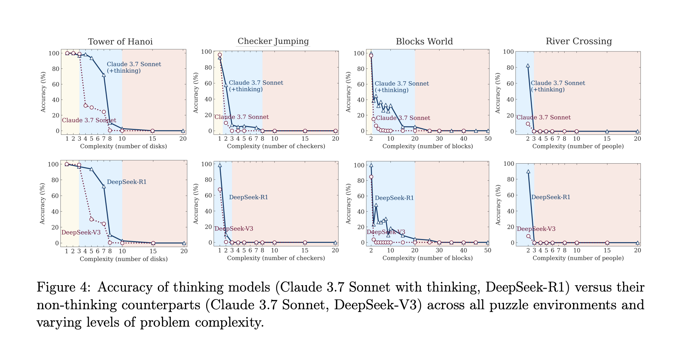

Last week, Apple released a paper titled [The Illusion of Thinking](https://ml-site.cdn-apple.com/papers/the-illusion-of-thinking.pdf), making the bold claim that LRMs (Large Reasoning Models, their acronym for Chain-of-Thought models) "fail to develop generalizable problem-solving capabilities for planning tasks, with performance collapsing to zero beyond a certain complexity threshold."

My take? The paper's conclusion is overstated. It misinterprets fundamental limits in model "memory" (i.e., context length) as limits in "reasoning." However, the study's framework for evaluating models against scaling complexity is a valuable contribution, as is its classification of three distinct performance regimes. This analysis will also offer an answer to one of the paper's open questions.

### A Quick Preface on CoT Models

The "reasoning" models in question here are largely based on a technique called Chain-of-Thought (CoT), where models are trained to "think" by generating text before providing an answer. This has been shown in numerous studies to increase benchmark performance. I'd suggest reading [DeepSeek's R1 Paper](https://arxiv.org/abs/2501.12948) if you want a deeper dive into how one of these models was trained.

### The Experiment: Puzzles on a Sliding Scale of Difficulty

To isolate "complexity" as the independent variable, the researchers rightly criticized standard benchmarks and instead created four puzzle environments where the difficulty could be precisely scaled:

1. **Tower of Hanoi** (exponential complexity growth)
2. **Checker Jumping** (quadratic complexity growth)
3. **River Crossing** (linear complexity growth)
4. **Blocks World** (linear complexity growth)

For each puzzle, Claude 3.7 Sonnet (with and without its "thinking" mode), DeepSeek-V3, and DeepSeek-R1 were tested 25 times per complexity level, with a max token length of 64k. The prompts described the rules, the goal, and provided an example. However, one instruction stands out:

> When exploring potential solutions in your thinking process, always include the corresponding complete list of moves.

We'll come back to that instruction.

### Key Findings: The Three Regimes of Complexity

The results consistently revealed "three regimes of complexity." At low complexity, standard models perform just as well as their Chain-of-Thought (CoT) counterparts. At medium complexity, the CoT models pull ahead, showing a clear performance advantage. But at high complexity, both models collapse, and their accuracy approaches zero.

In the paper's "open questions" section, the authors note that when the model is explicitly given the solution algorithm for the Tower of Hanoi environment, performance doesn't improve at all. They write:

> "This is noteworthy because finding and devising a solution should require substantially more computation... than merely executing a given algorithm."

On the surface, this is surprising. But it's telling that this experiment was only reported for Tower of Hanoi—the single puzzle with *exponential* complexity growth. I wonder if there's a correlation between the model's collapse point, the number of moves required at that point, and its maximum context length?

### My Theory: This Isn't a Reasoning Failure, It's a Context Length Failure

Let's take a closer look at Tower of Hanoi. For Claude, the model begins to collapse when N=10 disks are used. The minimum number of moves to solve this puzzle is 2^10 - 1, or **1,023 moves**.

Remember that crucial part of the prompt? The model was instructed to include the *complete list of moves* in its thinking process. Using a token calculator, we can estimate that 1,000 moves in the specified format (moves = [[disk id, from peg, to peg], ...]) consumes roughly **7,000 tokens**. Since the model was prompted to "always include" this list while exploring solutions, it's likely this 7,000-token block appears multiple times within a single Chain-of-Thought process, clogging up the 64k token context window.

The problem becomes even clearer at higher complexities. For N=14, a correct solution would require over 16,000 moves, taking up ~112,000 tokens—far exceeding the 64k token limit. Yet the paper includes charts with results up to N=20. My theory is that the model's failure isn't a lapse in logic; it's simply running out of room to write down the answer. It could likely reason through more complex versions of the problem if it had a large enough context window to do so.

### Conclusion

Overall, this is an interesting paper with useful contributions, but I'd have to see the results of a few follow-up experiments before I go around shouting that reasoning models can't actually reason. I'd like to see this evaluation repeated with the context length scaled as an additional independent variable. I'd also like to see if providing the algorithm helps in the other puzzle environments. I posit that for those puzzles, we would see a distinct performance increase.

And if anyone from an AI lab wants to give me some model credits to test this theory myself, I'd be happy to put on a researcher hat for a weekend.