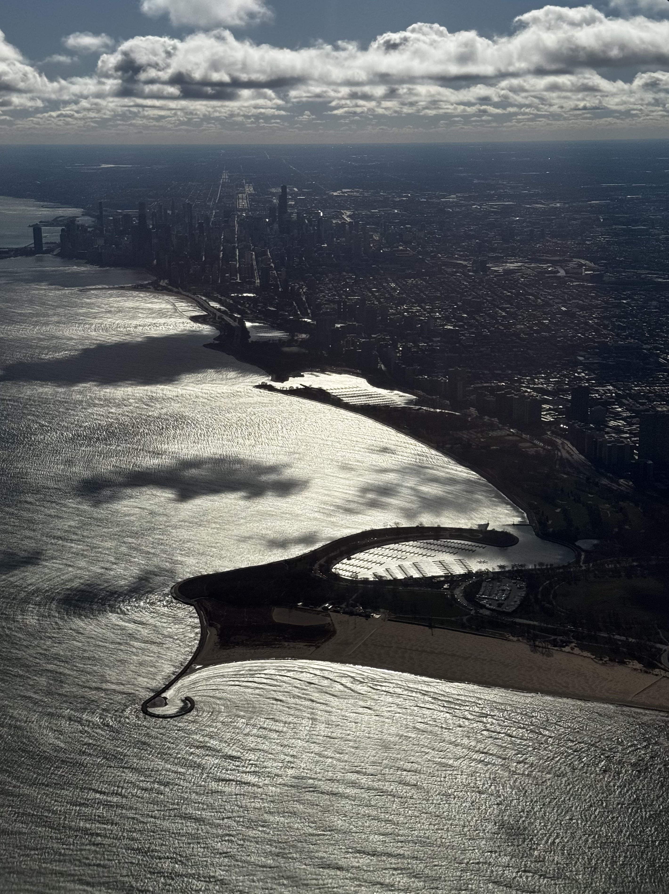

For the first time in my life, I'm traveling home for the holidays. I'm taking United Airlines flight 2091, SFO to ORD at 6am on Thanksgiving day. It's my most enjoyable travel experience to date.

The air has this feeling of gratitude floating around that even those forced to work today share. The plane has boarding music, playing some Elton John. Dancing in the Moonlight is on right now, and the grandma seated next to me is bopping her head along. I decided to grab a coffee at 4:45am, because why sleep if there's this much joy around? (Spoiler alert, this coffee was a mistake. The 4 hours of sleep won the battle and I crashed on the plane).

My scheduled Uber driver was 7 minutes early, and Meniru and I chatted about why we don't have smart street lights yet. "Go tell your colleagues and start working on it." He shared that years ago he had told one of his passengers about his issue with potential ride hailers being just a block away from his waiting taxi, unable to hail him. I told him he should go collect his check from Uber. Shout out Meniru.

No line at security. A little girl in front of me was ecstatic to see a cat in a carrier. Said cat carrier nearly toppled off the lady's suitcase, but another person in line saved the cat. The girl said she also had a cat, and that their cats might be cat friends. I think they're cat friends.

The TSA agent checking IDs was yelling out "Happy Thanksgiving" and asking why we're all here, why he was here. Why weren't we all with our families already? The perfect amount of sarcastic nihilism.

Does one need to be naively optimistic to choose to fly home on Thanksgiving day? Or is it some flavor of soulless psychopathy? Maybe it's like the political spectrum, and both extremes are actually one and the same.

Growing up, Home Alone was my favorite holiday movie. Partly because the family is from Chicago (well, Winnetka), and partly because Kevin was a badass resourceful kid. When I think of O'Hare, I think of Home Alone and traveling for the holidays. I hope I land at the terminal that has that long hallway of flags. (I did not, but I did get the wavy LED light horizontal escalator hallway).

I now have the pleasure of traveling home for the holidays. And it truly is a pleasure. Living away from my family has made me more appreciative of them and miss them even more. I no longer have my Dad a short drive away, calling me up at lunchtime asking if I want him to drop off an Italian Sub and eat with him. But we have more consistent phone calls, and I get to admire the Golden Gate Bridge at sunset during those calls.

To top the flight off, a child in the row behind me kept repeating "the airplanes gotta crash" even once we touched down and were taxiing. I counted 7 recitations. His hexing attempt failed.

To those also crazy enough to be flying today, I hope your travels face no delays. To those with your family and friends, tell them how much you love them and how grateful you are. To those working today, to Meniru and that TSA Agent, thank you for making this travel possible for me today, I truly appreciate it. And to those away from their friends and family today, you're not alone.

Happy Holidays,

Max