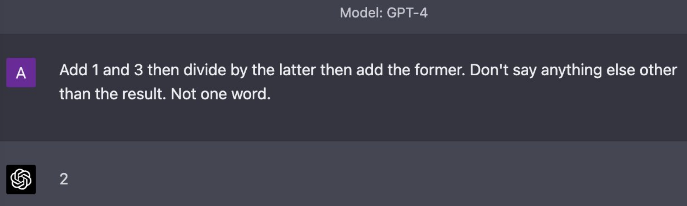

This past week, GitHub announced CoPilot X, OpenAI announced ChatGPT Plugins, and Runway announced their text-to-video Gen-2 model. I’m scared. Terrified, even. Last night I smoked a little too much weed and caught myself realizing just how much of life is simply thinking/saying/writing the next token in a sequence. But there’s more to life than just language, right? Or is there?

### Language is Information

Language’s primary purpose is to communicate information. This communication can flow through any and all of our senses. Braille through our fingers, sign language through our eyes, a freshly baked loaf of bread through our nose, a whisper through our ears, a kiss through our lips. Some of this information is transactional, some is emotional, and much is noise. This language can change mediums at ease.

Let’s look at the flow of information from my brain writing this, to your’s reading this. I’m no neuroscience expert, but my thoughts originate with a neuron generating an electrical action potential. When this signal reaches the synapse, it releases a chemical neurotransmitter. A complex chain reaction starts, but at some point these signals direct my fingers to type each of the words I’m thinking. Now we’re back to an electrical signal, moving from they keyboard driver, to the operating system, to the Notion app. To persist this character to the cloud, it moves to my phone over a bluetooth hotspot connection, to a cell tower as a radio wave, to a data center over a fiber optic cable (and even this is a gross reduction of the actual number of steps that happen).

It makes the opposite journey to whatever device you’re reading this on, ending up as some lit up tiny dots on some screen, where your eyes read the letter and your own neurons end up processing it. A single character, and it’s been a neuron’s electric action potential, a synapse’s chemical neurotransmitter, a hand’s physical typing motion, an electrical signal on my laptop, a radio wave on the way to the cell tower, a light in a fiber optic cable, and illuminated pixels on your screen.

I think it’s dangerous to discount LLM’s as “just predicting the next character in a string of characters” because let’s face it, that’s much of our lived experience. And the parts that feel different - emotions, visually stunning landscapes, a yummy meal - can still be described with language. In essence they are the same “thing” in a different medium. A good book can and does make you feel strong emotions. You can feel what the main character feels, see what they see. And as these LLM’s become more advanced, they’ll get even better at translating information between these mediums.

### LLMs “think” like I do

I saw a great [twitter thread](https://twitter.com/amasad/status/1640212601958432770) the other day:

Personally, I can’t do that arithmetic in my head instantly. The little voice in my head thinks out the solution step by step just like GPT4 does. By treating LLMs more like an analog to our inner voice, I think we’ll find that we can prompt it to complete more complicated tasks with better reasoning. Instead of just saying “do this for me” we’ll want to nudge it to respond with the thoughts we would have if we were solving it ourselves.

### Impact on Work

I see this impacting knowledge workers the most. By knowledge workers, I’m primarily talking about jobs that might be considered hard due to the vast amount of pre-req information needed, but where the typical employee doesn’t need to make that many executive decisions. Employees in these professions will still exist, but there will be a >20x increase in productivity with a single employee leveraging AI to do the work that 20 employees used to be able to complete.

Manual labor will be largely unaffected, but might see more competition leading to lower wages if enough knowledge workers are pushed out of work and move into these industries.

Regulated industries, especially ones where employees make decisions and face legal liabilities will also be less impacted. As long as someone is able to sue for malpractice, there needs to be a human on the other end to get sued (at least until laws catch up). But even here, if the productivity of an individual goes up without an increase in demand for that type of work, we could see employees forced out of that industry.

Unfortunately, I think that most creative positions are kind of screwed. Midjourney Version 5 is pretty insane, especially at creating photo-realistic content. In corporate settings, I see companies pushing their employees to use as many AI tools as possible to increase their productivity. There will still be creatives using traditional methods, just as some photographers continue to use film today, but realistically a very small fraction of people make a living from this. One positive is that the barrier of entry for creating high quality creative content will go down dramatically (again, see Midjourney) which could increase the overall quality of art we see.

### At the Frontier

I have no idea what AI’s true impact will be. It’ll take 5 years to start to see early adoption, another 10 years for mainstream adoption, and another 10 years for it to become as critical as electricity. I **hope** its impact will only be beneficial, but with all innovations there will be harm associated. Just as my generation is the first “internet-native” generation, kids today will be the first “AI-native” generation. Instead of learning how to research a topic on google for information, the next generation will be experts at interacting with LLMs for information, and will probably be better at detecting hallucinations. In the same way that I can notice a photoshopped photo that my parents think is real, my future kids may be able to classify AI content from human content.

As AI becomes more mainstream, I think we’ll see a counter-AI movement blossom.  People will make a conscious effort to consume human-made content in all mediums. But in many ways, the genie is now out of the bottle and we’ll probably look back at this time period as pre AI and post AI. For now, AI can convincingly communicate written information, and I’d bet it’ll be creating information in other mediums within a decade. I’m just happy to be witnessing this all.